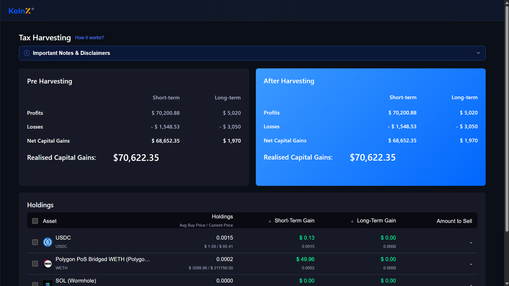
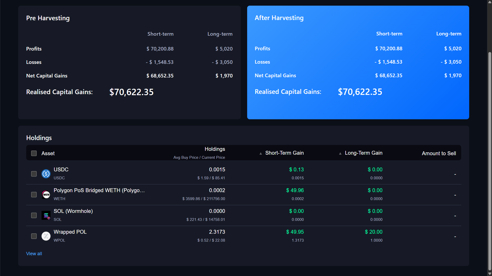
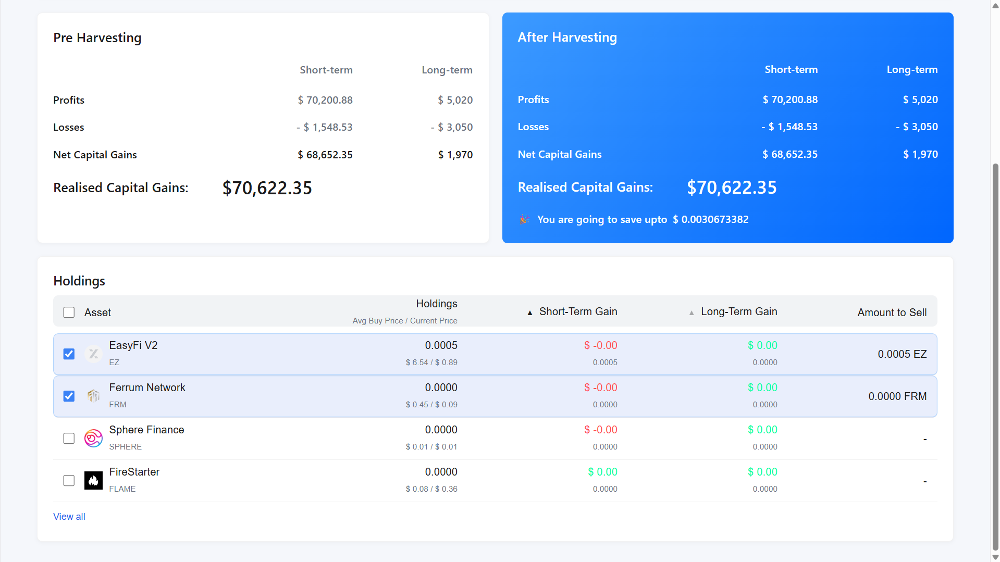
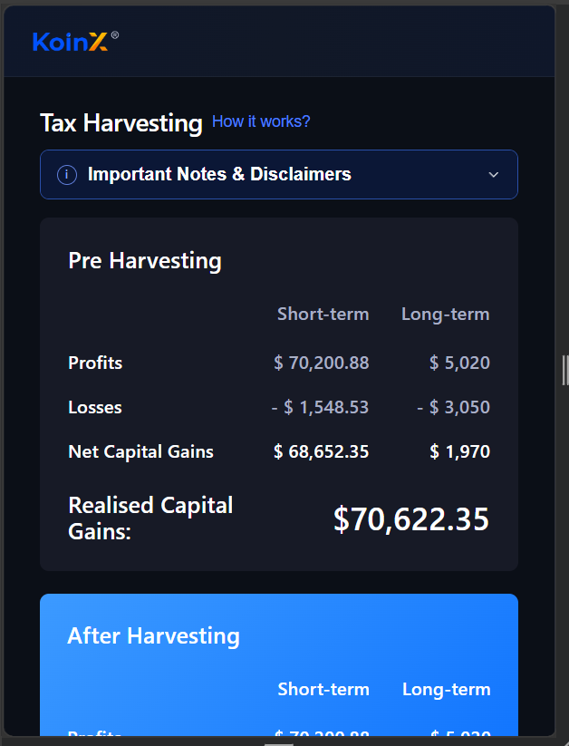
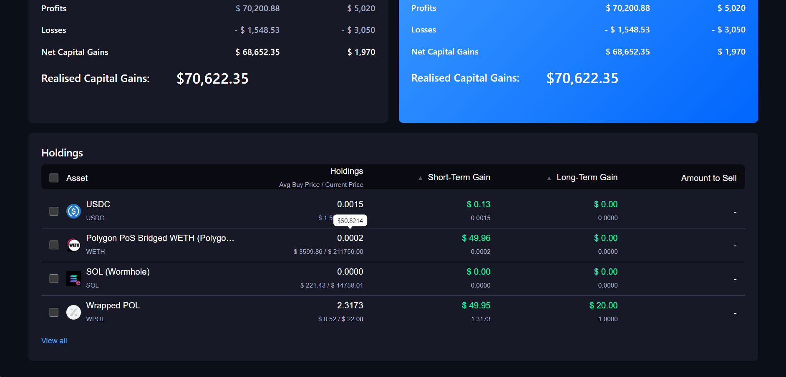
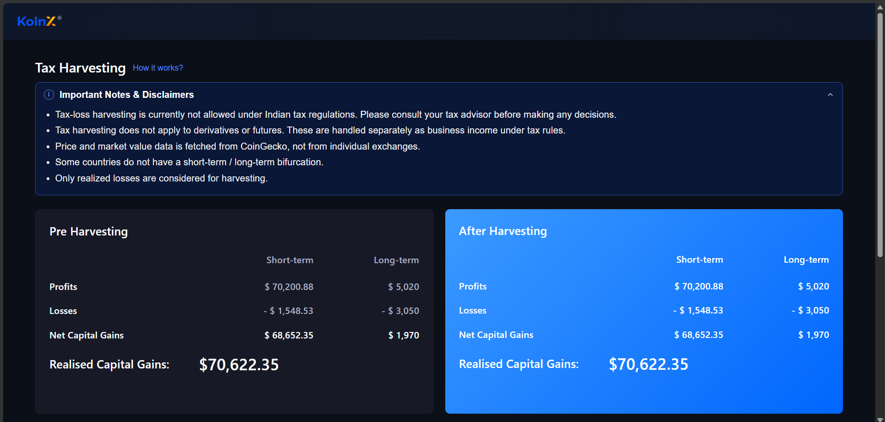

# Tax-Loss Harvesting Dashboard

A professional, full-stack web application designed to help users overview their cryptocurrency holdings, visualize their current tax burden, and understand potential tax savings through tax-loss harvesting strategies.

## ✨ Features

- **Responsive Design**: Full support for desktop, tablet, and mobile views.
- **System Theme Support**: Seamlessly adapts to light and dark modes based on the user's system preferences.
- **Reusable UI Components**: Clean project structure utilizing isolated, reusable components (Summary Cards, Disclaimer Bars, Tooltips, Tables).
- **Interactive Holdings Insights**: Includes a robust data table and interactive components with precise hover states.
- **RESTful JSON APIs**: Dedicated backend serving crypto asset data and capital gains summaries.
- **Real-World Assets**: Utilizes live CoinGecko image URLs for accurate cryptocurrency logos.

## 🛠 Tech Stack

**Frontend**
- React
- TypeScript
- Vite
- Vanilla CSS 
- Lucide React (Icons)

**Backend**
- Node.js
- Express
- CORS Middleware

## 📂 Folder Structure

```text
.
├── backend/                        # Node.js + Express Server
│   ├── data.js                     # Mock data arrays and objects
│   ├── package.json                # Backend dependencies
│   └── server.js                   # Main application server
└── Tax-Loss-Harvesting/            # React + TypeScript Frontend
    ├── src/
    │   ├── assets/                 # Static visual assets
    │   ├── components/             # Reusable UI components (Header, Tables, Cards, etc.)
    │   ├── styles/                 # Component-specific CSS stylesheets
    │   ├── utils/                  # Helper formatting functions
    │   ├── App.tsx                 # Main application view component
    │   └── main.tsx                # Application entry point
    ├── package.json                # Frontend dependencies
    └── vite.config.ts              # Vite configuration
```

## 🚀 Getting Started

Follow the instructions below to set up and run both the backend and frontend locally.

### Backend Setup

1. **Navigate to the backend directory**:
   ```bash
   cd backend
   ```
2. **Install dependencies**:
   ```bash
   npm install
   ```
3. **Start the backend server**:
   ```bash
   node server.js
   ```
   *The server will start running on `http://localhost:5000`.*

### Frontend Setup

1. **Navigate to the frontend directory**:
   ```bash
   cd Tax-Loss-Harvesting
   ```
2. **Install dependencies**:
   ```bash
   npm install
   ```
3. **Start the frontend development server**:
   ```bash
   npm run dev
   ```
   *The Vite server will start, typically accessible at `http://localhost:5173`.*

> **Note:** Ensure the backend server is running simultaneously so the frontend can successfully fetch data!

## 📡 API Endpoints

The backend currently uses a **mock data architecture** built directly into the server to simulate database requests and responses, allowing for quick frontend development. 

The application utilizes the following endpoints running locally on port 5000:

- `GET /api/holdings`: Returns the mock list of current user cryptocurrency assets, including current prices, quantities, and P&L (Profit and Loss) metrics.
- `GET /api/capital-gains`: Returns calculated potential pre-harvest and post-harvest tax bounds.

## 📖 Features Explained

### System Theme Support
The application uses native CSS variables and `@media (prefers-color-scheme: dark)` to easily query the operating system's theme preference. This effortlessly toggles the entire UI between a crisp light mode and a sleek dark mode without needing manual user configuration.

### Responsive Mobile Layout
Using modernized CSS Flexbox, CSS Grid, and media queries, the layout reflows dynamically. Features like tabular data degrade gracefully on smaller screens to ensure the dashboard remains perfectly usable on mobile without breaking UI bounds.

### Reusable Summary Cards
Core metrics (such as distinct capital gains totals and expected tax savings) are broken down into isolated `Card` components, allowing easy visual updates to metric presentation across the entire app from a single styling source of truth.

### Tax Harvesting Disclaimer Dropdown
Due to the complex nature of tax guidance, an interactive accordion-style dropdown acts as a disclaimer bar. This utilizes semantic HTML and clean animation transitions so users can reveal legal warnings natively without cluttering the screen context.

### Tooltip Behavior on Numeric Values
Interactive tooltips wrap precise currency values across the app. Hovering over a truncated or rounded UI figure naturally reveals an accurately formatted metric (up to 5 decimal places precision) in a dynamically positioned hover-window with perfectly aligned tool-tip indicators.

### Mock Backend APIs
To showcase full-stack integration without relying on complex database setup, the application interacts with actual `fetch`/XHR requests hitting simple Express endpoints. This cleanly simulates standard loading states and cross-origin resource sharing (CORS).

### Capital Gains Calculation Logic
The application visually breaks down "Before" bounds and "After" bounds into segmented charts or cards representing the user's short-term vs. long-term holdings, giving a digestible summary of optimized asset offloading.

### Holdings Table
A rich, tabular presentation of the user's portfolio. It aligns figures properly, renders corresponding UI icons mapped perfectly to standard external CoinGecko image URLs via dynamically constructed properties, and incorporates smart column width rules.

### Hover States and UI Polish
Virtually every interactive element includes soft transition delays, background shading shifts, or interactive shadow lifting to provide the user with responsive feedback native to professional-grade finance products.

## 📸 Screenshots

### Dashboard Overview


### Dark Theme View


### Light Theme View


### Mobile Responsive View


### Tooltip Example


### Disclaimer Dropdown Example

